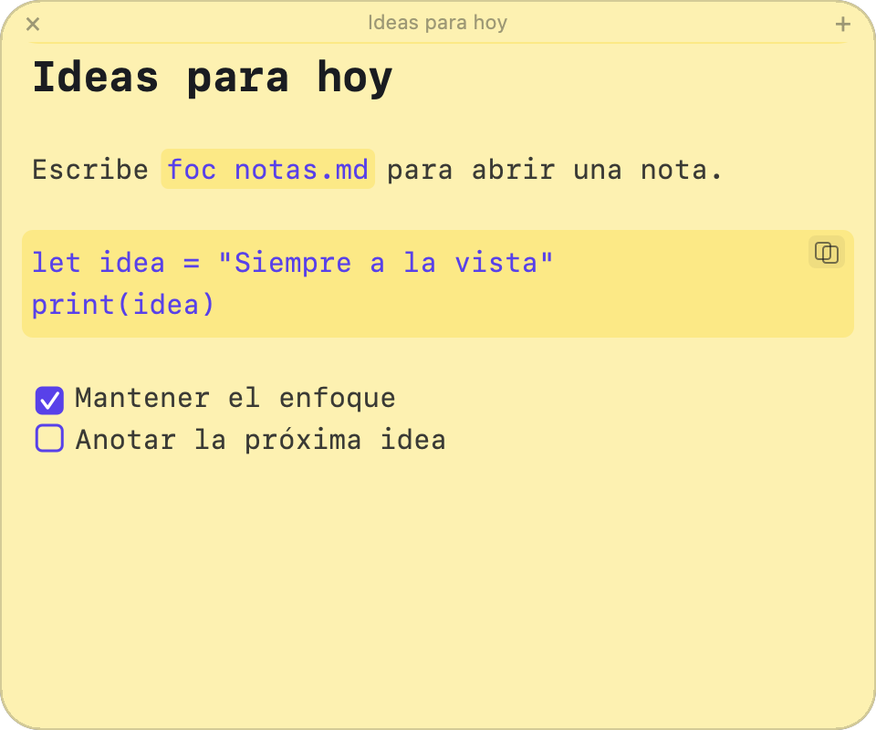

<h1 align="center">Focnotes</h1>

<p align="center">
  Una nota flotante para macOS con vista previa Markdown dinámica.
</p>

<p align="center">
  <a href="https://github.com/giarf/focnotes/releases/latest"></a>
  
  
</p>

<p align="center">
  
</p>

Focnotes se mantiene por encima de otras apps y aparece en todos los escritorios virtuales, parecido al comportamiento de Picture in Picture.

## Requisitos

- macOS 13 o superior

## Instalar

### Homebrew

```sh
brew install --cask giarf/tap/focnotes
```

El cask verifica el SHA-256 de la descarga y elimina automáticamente la cuarentena de la aplicación instalada.

### DMG

<p align="center">
  <a href="https://github.com/giarf/focnotes/releases/latest/download/Focnotes-26.7.0.dmg">
    
  </a>
</p>

Descarga el DMG, abre la imagen y arrastra Focnotes a Aplicaciones.

La aplicación tiene firma ad hoc y aún no está notarizada por Apple. Si macOS indica que no puede verificar al desarrollador, elimina la cuarentena únicamente después de comprobar que descargaste el DMG desde este repositorio:

```sh
xattr -dr com.apple.quarantine /Applications/Focnotes.app
```

También puedes abrirla desde **Ajustes del Sistema > Privacidad y seguridad > Abrir igualmente**.

## Compilar

Necesitas Xcode Command Line Tools para compilar desde el código fuente.

```sh
make app
```

La app queda en:

```sh
build/Focnotes.app
```

Para generar el DMG universal de distribución:

```sh
make dmg
```

## Ejecutar

```sh
make run
```

## Instalar compilación local

```sh
make install
```

Esto instala la app en `/Applications/Focnotes.app`. Dentro de la nota, pulsa **Instalar foc** para agregar el comando a `/usr/local/bin`; macOS solicitará autorización de administrador.

```sh
foc nota.md
foc nota.txt
foc "archivo con espacios.txt"
```

El archivo se abre como nota flotante y se guarda automáticamente al escribir. Si no existe, se crea.

## Comportamiento

- Nota flotante siempre encima de ventanas normales.
- Visible al cambiar de escritorio virtual o Space.
- Ventana sin icono en el Dock ni entrada en `⌘Tab`.
- Arrastrable desde el fondo de la nota.
- Redimensionable.
- Configuración con `⌘,` para controlar la ventana y el tamaño del editor.
- Atajo global `⌘⇧N`, configurable, para traer la nota al frente y enfocar el editor.
- Varias notas internas sin archivo, guardadas automáticamente en `UserDefaults`.
- Menú separado para notas internas y archivos recientes o fijados.
- Apertura de la última nota interna o archivo al iniciar, configurable y activada por defecto.
- Renderizado Markdown dinámico mientras escribes.
- Checkboxes GFM clicables sin modificar el Markdown fuera del marcador.
- Título fijo superior basado en el primer encabezado Markdown o en el nombre del archivo.

## Markdown dinámico

Focnotes usa `swift-markdown` y `cmark-gfm` para interpretar Markdown con soporte de GitHub Flavored Markdown. El archivo sigue siendo texto Markdown normal; el renderizado visual se aplica encima con TextKit.

La idea principal es separar tres capas:

- Fuente: el contenido real del archivo `.md`.
- Parser: un AST Markdown con rangos de origen.
- Presentación: fuentes, colores, checkboxes y detalles visuales en la nota.

Esto evita que el renderizado reescriba el archivo o rompa el cursor mientras se escribe.

## Detalles de implementación

- El Markdown se mantiene como única fuente de verdad.
- El renderizado se recalcula al editar o mover el cursor.
- Los encabezados aplican tamaño y grosor dentro del editor.
- El título superior muestra el primer encabezado Markdown; si no hay encabezado, muestra el nombre del archivo.
- Las checkboxes se guardan como `- [ ]` y `- [x]`.
- Los archivos antiguos con `☐`, `☑` o `•` se normalizan al abrirse.
- El comando `foc` abre la misma app desde la que se instala, evitando usar builds antiguos.
- El icono de la barra de menú es una foca minimalista en modo template.
- El icono de la aplicación usa la misma foca con fondo amarillo.

Nota: macOS sigue representando este tipo de UI como una ventana/panel internamente. Lo importante es el comportamiento: `canJoinAllSpaces`, `fullScreenAuxiliary`, `stationary` y nivel flotante.
